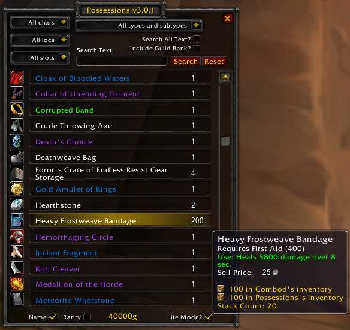

# Possessions

### [Download Latest](https://github.com/fondlez/Possessions/releases/latest)

Source:

- WotLK (3.3) port: https://www.wowinterface.com/downloads/info16199-PossessionsWotLK3.3.html
- original addon: https://legacy.curseforge.com/wow/addons/possessions/

***

## Description

### WotLK (3.3) Port

I love this addon and it broke a few patches ago. I decided to clean it up to 
remove most of the errors. While I was at it I added a feature to filter out 
items from any guild bank (a checkbox above the search button).

### Original Addon

Possessions is an addon to keep track of your entire inventory.

It will keep track of the items and money on all your alts (per server), 
including worn items, items in your inventory, items in your bank and even items 
in your mailbox (that you have mailed or seen).

## Usage
- [x] `/poss`: Opens the main Possessions window
- [x] `/poss <text>`: This opens up the window listing all items matching the 
text, e.g. '/poss silk' will show all Silk Cloth, among other "silk" named items.

## Similar Addons

- [BankItems](https://legacy.curseforge.com/wow/addons/bank-items)

## Credits

### Original Addon
Thanks to Derkyle for ItemsMatrix, which I've borrowed the UI code of InvCheck 
from. Thanks to Zzirh for the mailbox idea :)

## Screenshot

